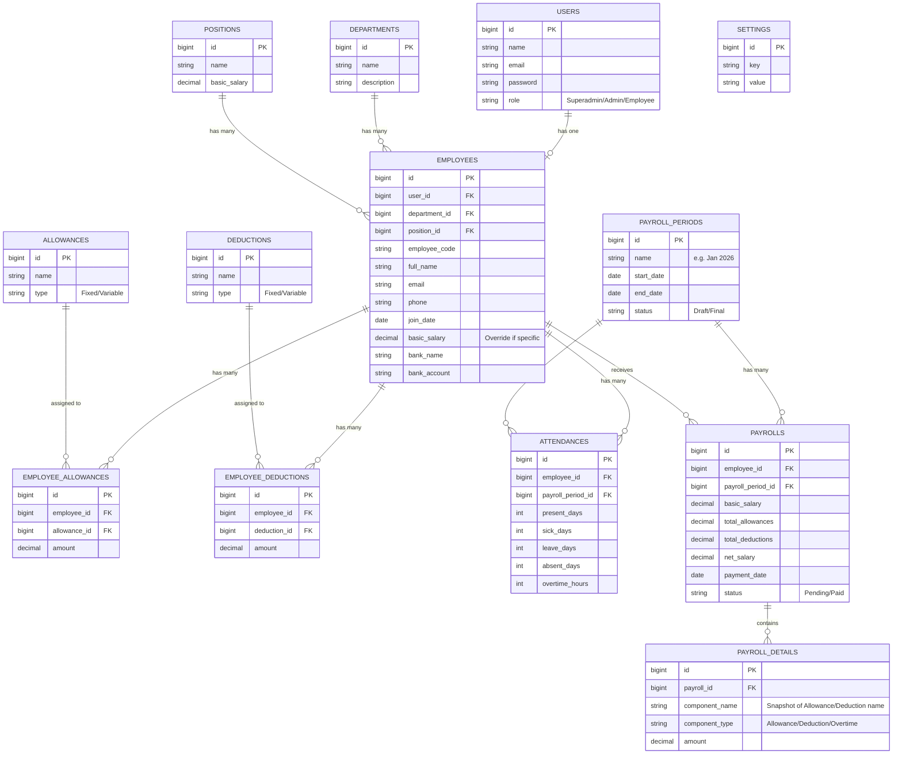

# Product Requirements Document (PRD): Sistem Penggajian (Payroll)

## 1. Pendahuluan
### 1.1 Latar Belakang
Proses penggajian yang dilakukan secara manual sering kali rentan terhadap kesalahan perhitungan (human error), memakan banyak waktu, dan sulit dilacak. Oleh karena itu, dibutuhkan sebuah sistem informasi penggajian (Payroll System) berbasis web yang dapat mengotomatisasi perhitungan gaji, pajak, tunjangan, dan potongan, serta menyediakan pelaporan yang akurat dan transparan baik bagi pihak manajemen maupun karyawan.

### 1.2 Tujuan Produk
* **Otomatisasi:** Menghitung gaji karyawan secara otomatis berdasarkan komponen gaji (gaji pokok, tunjangan, potongan, lembur, dan absensi).
* **Akurasi:** Meminimalkan kesalahan perhitungan gaji.
* **Transparansi:** Menyediakan slip gaji digital yang dapat diakses dengan mudah oleh karyawan.
* **Efisiensi Laporan:** Memudahkan HR dan Keuangan dalam melakukan rekapitulasi dan pembuatan laporan bulanan.

### 1.3 Target Pengguna
1. **Superadmin / Pemilik:** Memiliki akses penuh ke seluruh fitur dan pengaturan sistem.
2. **Admin / HRD:** Mengelola data karyawan, absensi, komponen gaji, dan memproses penggajian bulanan.
3. **Karyawan:** Dapat login untuk melihat profil, mengecek riwayat gaji, dan mengunduh slip gaji bulanan (opsional tergantung ruang lingkup).

---

## 2. Ruang Lingkup Fitur (Functional Requirements)
### 2.1 Modul Manajemen Pengguna & Hak Akses
* CRUD pengguna sistem.
* Manajemen Role (Superadmin, Admin, Karyawan).

### 2.2 Modul Master Data
* **Data Departemen (Divisi):** CRUD data departemen perusahaan.
* **Data Jabatan (Posisi):** CRUD data jabatan beserta standar gaji pokok (opsional).
* **Data Komponen Gaji:** CRUD master tunjangan (Allowances) dan potongan (Deductions).

### 2.3 Modul Manajemen Karyawan
* CRUD biodata karyawan (Nama, NIK, Alamat, Kontak, Status Pernikahan, dll).
* Penentuan departemen dan jabatan karyawan.
* Setup rincian gaji (gaji pokok karyawan, penetapan tunjangan dan potongan tetap).
* Data rekening bank karyawan.

### 2.4 Modul Kehadiran & Lembur
* Input/Upload data absensi karyawan per periode (hari kerja, sakit, izin, alpa).
* Input/Upload data lembur (overtime).

### 2.5 Modul Proses Penggajian (Payroll Core)
* Pembuatan periode penggajian (contoh: Januari 2026).
* Proses hitung gaji (Generate Payroll): Sistem otomatis mengalkulasi Gaji Pokok + Total Tunjangan + Lembur - Total Potongan - Pajak.
* Validasi dan finalisasi (Approval) data gaji bulanan sebelum diterbitkan.

### 2.6 Modul Laporan & Slip Gaji
* Cetak & Unduh Slip Gaji (format PDF).
* Laporan Rekapitulasi Penggajian Bulanan (format Excel/PDF).

### 2.7 Modul Pengaturan (Settings)
* Konfigurasi profil perusahaan (Nama, Logo, Alamat, TTD Dokumen).

---

## 3. Data Schema & Architecture
Sistem dibangun menggunakan framework **Laravel** dengan arsitektur **MVC (Model-View-Controller)**. Database menggunakan sistem relasional (RDBMS) seperti MySQL, PostgreSQL, atau SQLite.

### 3.1 Penjelasan Naratif Struktur Data
Struktur database dirancang agar terstandarisasi dan mudah dikembangkan. Berikut adalah entitas utama dalam sistem:

1. **`users`**: Menyimpan kredensial otentikasi login.
2. **`departments`**: Menyimpan daftar departemen/divisi dalam perusahaan.
3. **`positions`**: Menyimpan daftar jabatan.
4. **`employees`**: Merupakan entitas sentral yang menyimpan data profil pekerja. Tabel ini berelasi dengan `departments`, `positions`, dan opsional dengan `users` (jika karyawan diberi akses login). Tabel ini juga menyimpan informasi gaji pokok default karyawan.
5. **`allowances` & `deductions`**: Tabel master untuk mendefinisikan jenis tunjangan (seperti tunjangan makan, transport) dan potongan (seperti BPJS, asuransi, denda keterlambatan).
6. **`employee_allowances` & `employee_deductions`**: Tabel pivot/relasi yang menghubungkan `employees` dengan `allowances` dan `deductions` untuk mengatur besaran tunjangan dan potongan spesifik per individu karyawan.
7. **`attendances`**: Menyimpan ringkasan kehadiran karyawan pada suatu periode tertentu (jumlah hadir, sakit, izin, alpa, jam lembur) yang akan menjadi dasar perhitungan gaji dinamis.
8. **`payroll_periods`**: Menyimpan siklus/periode penggajian (misalnya: "Gaji Januari 2026").
9. **`payrolls`**: Transaksi utama penggajian yang mengaitkan `employees` dengan `payroll_periods`. Menyimpan total gaji pokok, total tunjangan, total potongan, dan gaji bersih (take home pay).
10. **`payroll_details`**: Merinci histori komponen dari suatu baris `payrolls`. Jika tunjangan/potongan master berubah di masa depan, data gaji yang sudah dicetak (historis) di tabel ini tidak akan terpengaruh.
11. **`settings`**: Tabel konfigurasi dinamis (key-value) untuk menyimpan preferensi aplikasi (logo, nama perusahaan, dll).

### 3.2 Visualisasi ERD (Entity Relationship Diagram)
Berikut adalah gambaran relasi entitas dalam format diagram Mermaid:

---

## 4. Persyaratan Non-Fungsional (Non-Functional Requirements)
* **Kinerja (Performance):** Mampu memproses/generate laporan penggajian untuk >1000 karyawan secara asinkron tanpa membebani server utama (bisa menggunakan Laravel Queues).
* **Keamanan (Security):** Perlindungan terhadap SQL Injection, XSS, dan CSRF. Akses data sensitif (besaran gaji) dibatasi secara ketat berdasarkan Role (RBAC). Data slip gaji hanya bisa diakses oleh karyawan bersangkutan dan HR/Superadmin.
* **Ketersediaan (Availability):** Sistem diharapkan berjalan dengan uptime 99.9%.
* **Usability:** Antarmuka responsif dan ramah pengguna (Mobile-friendly) menggunakan template Bootstrap (NiceAdmin).
* **Skalabilitas:** Arsitektur modular agar di masa depan mudah diintegrasikan dengan mesin absensi (Fingerprint/API) dan sistem pembayaran otomatis bank (Bank Gateway).
